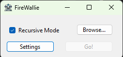
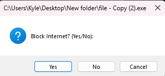
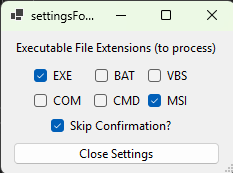

# firewallie

#### Simplifies blocking internet access for some or all of the executables within a specific directory using Windows Firewall

## Details
- **Status: Functional** *(testing)*
- **Version: 1.0.1** *(beta)*
- **Author: Kyle Walters** *(jorkle)*
- **Platform: Windows** *(tested on Windows 11)*
- **License: Apache 2.0**

## Description

- **Firewallie** searches the selected directory for executables _(recursive option)_ and prompts Yes/No to block internet access for the executables using Windows Firewall

## Screenshots

### Initial Window

### Blocking (prompt) Window

### Settings Window

